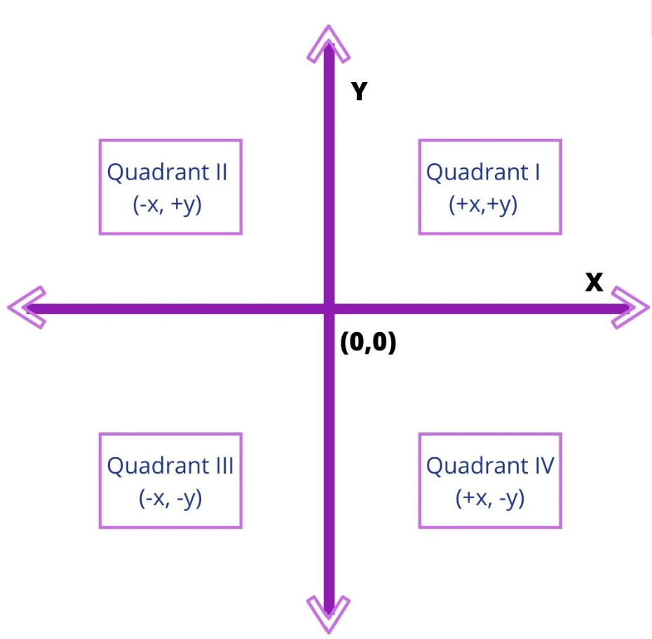

# Libraries

There is an idea in computer science called `abstraction`. This word means to hide details that are currently un-important to the given task. For example, if you wanted to make a phone call you just need to know how to unlock your phone, select the recipient and initiate the call. Things that have been `abstracted` for you and are not currently important to see is, phone to tower communication, the code that makes button presses work, data encryption, ...  This is relevant to you as this assignment is asking you to create more shapes. You could bring over all the code you used in previous lessons or you could us something called a `library`.

The library is code that someone else has written that you can use. In most cases you don't care how exactly this code works as long as it does what you are looking for. This `abstraction` helps you write code faster as you can depend on others work to complete your tasks faster.

```python
import pygame #This goes at the top of main.py
```

## Task 1
`import` the library called `turtle` 
#

Here is an example of how to use the turtle to make a triangle

```python
t0 = turtle.Turtle() #first you must make a turtle object, this one is called t0

side_length = 70
num_sides = 3
angle = 360.0 / num_sides
 
t0.forward(side_length) # move forward
t0.right(angle) #move clockwise
t0.forward(side_length) #not DRY
t0.right(angle) #not DRY
t0.forward(side_length) #not DRY
t0.right(angle) #not DRY

########################################################################

t0.penup() #pick up the pen so the turtle does not draw
t0.goto(10,10) #move the turtle to a new position
t0.pendown() #put down the pen so the turtle will draw
t0.color('green') #change the color it will draw
 
for i in range(num_sides):
    t0.forward(side_length)
    t0.right(angle)
     
turtle.done()
```
The first half of the code does not follow the `DRY`(Don't Repeat Yourself) rule. The second half of the code draws the same shape in a different position and color and is `DRY`

## Task 2
Make your turtle draw a rectangle/square with repetitive code like the first half of the example
#

## Task 3
Make your turtle draw a rectangle/square with `DRY` code like the second half of the example
#

After completing the tasks you might be wondering how you should have known the functions `.forward .right .goto . penup`. We can find the most common functions here: https://www.geeksforgeeks.org/turtle-programming-python/ but if you want to see everything about turtle that can be found here: https://docs.python.org/3/library/turtle.html

Next you need to understand what `.goto(10,10)` does. If you look at the picture below you can see that it means start the turtle 10 units right and 10 units up.


## Task 4
Turn your square making code from task 3 into a function with this signature `shape(x, y, sides, side_length, border_color)`

Your python function will be declared like this:

```python
def shape(x, y, sides, side_length, border_color):
  code
```
#

## Task 5
Now that you know the basics and have the links to the documentation use your function from task 4 to do the following:
1. make a shape that does not touch any other shape
2. the shape should be a unique color
3. the shape should be filled in (not just the outline)
#

## Task 6
Make a function that will create rectangles
#

## Task 7
Make a simple drawing like a house or a smiley face. It must include at least 2 shape types.
#

